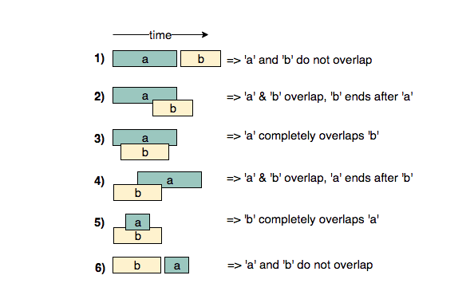

# Pattern-Wise-Questions

Pattern 1: Sliding Window
In many problems dealing with an array (or a LinkedList), we are asked to find or calculate something among all the contiguous subarrays (or sublists) of a given size. There we use Sliding Window Approach.
Time Complexity : O(N)

Pattern 2: Two Pointers
In problems where we deal with sorted arrays (or LinkedLists) and need to find a set of elements that fulfill certain constraints, the two pointers approach becomes quite useful. The set of elements could be a pair, a triplet or even a subarray.
Time Complexity : O(N^2)

Pattern 3: fast & Slow Pointers
The Fast & Slow pointer approach, also known as the Hare & Tortoise algorithm, is a pointer algorithm that uses two pointers which move through the array (or sequence/LinkedList) at different speeds. This approach is quite useful when dealing with cyclic LinkedLists or arrays.
Time Complexity : O(N)

Pattern 4 : Merge Intervals
This pattern describes an efficient technique to deal with overlapping intervals. In a lot of problems involving intervals, we either need to find overlapping intervals or merge intervals if they overlap.

Given two intervals (a and b), there will be six different ways the two intervals can relate to each other:

a and bdo not overlap
a and b overlap, b ends after a
a completely overlaps b
a and b overlap, a ends after b
b completly overlaps a
a and b do not overlap
Understanding the above six cases will help us in solving all intervals related problems.

Time Complexity: O(nlogn)

Pattern 5: Cyclic Sort
This pattern describes an interesting approach to deal with problems involving arrays containing numbers in a given range.
Time Complexity = O(n)

Pattern 6: In-place Reversal of a LinkedList
In a lot of problems, we are asked to reverse the links between a set of nodes of a LinkedList. Often, the constraint is that we need to do this in-place, i.e., using the existing node objects and without using extra memory.
Time Complexity : O(n)